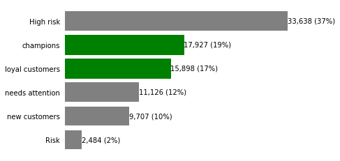

# Project 1: Customer Segmentation for E-commerce Growth (RFM Analysis)

**Overview:** 
Segmented customers of a real-world e-commerce store using transactional data to uncover high-value audiences and improve marketing ROI.

**Business Problem:**
E-commerce businesses often struggle to identify which customers to target for retention, upselling, and reactivation campaigns.

**Objective:**
Identify distinct customer segments based on purchasing behavior to enable data-driven marketing strategies that increase revenue and customer lifetime value (CLV).

**Dataset:**
- Source: Kaggle (real-world dataset)
- Period: April 2020 – November 2020
- Industry: Home appliances & electronics e-commerce
- [View Dataset](https://www.kaggle.com/mkechinov/ecommerce-purchase-history-from-electronics-store)

**Methodology:**
- Data cleaning & preprocessing using Python (Pandas)
- RFM (Recency, Frequency, Monetary) analysis
- Customer scoring and segmentation
- Clustering validation using silhouette score
- Data visualization (customer distribution & segment insights)

**Key Insights:**
- Identified high-value “loyal customers” contributing disproportionally to revenue
- Detected “at-risk” customers suitable for re-engagement campaigns
- Revealed low-frequency users with upsell potential

## Visualizations

### Customer Segments Distribution

### RFM Score Analysis

**Business Impact (How this would be used):**
- Target high-value segments with retention campaigns → increase repeat purchases
- Reactivate churn-risk customers → reduce customer acquisition cost (CAC)
- Personalize promotions → improve conversion rates

**Tools & Skills**
Python (Pandas, NumPy), Data Visualization, RFM Analysis, Customer Segmentation, Clustering Evaluation

**Note**
This project was developed as part of a graduation project using a real-world dataset, simulating a real business scenario and decision-making process.

